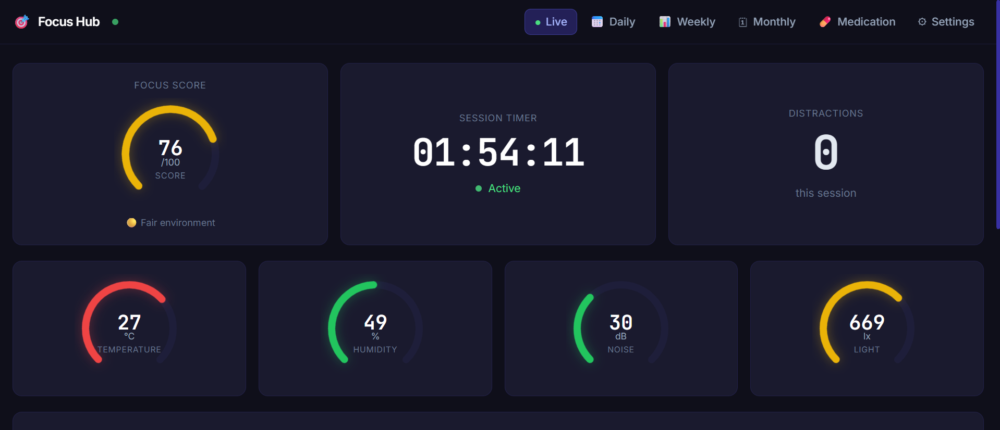
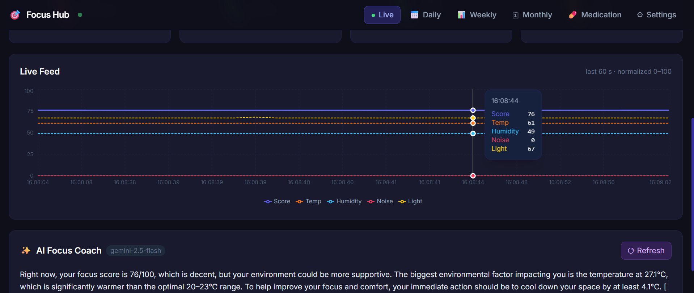
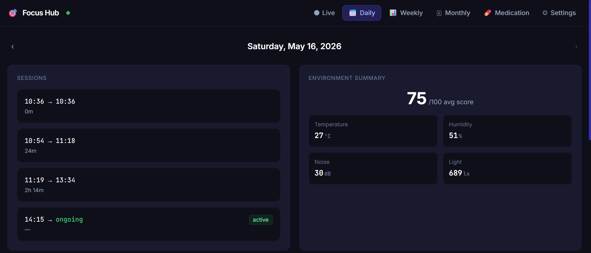
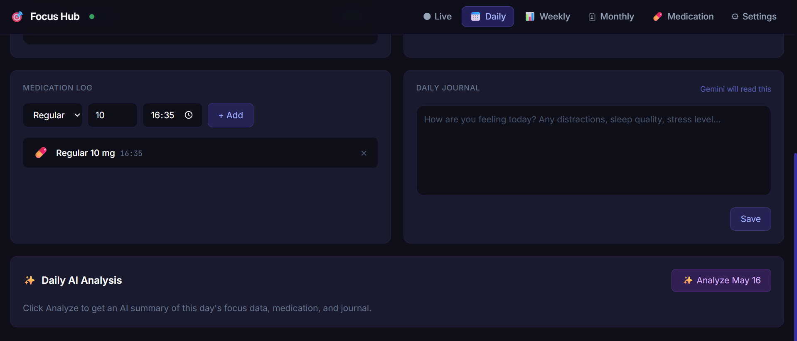
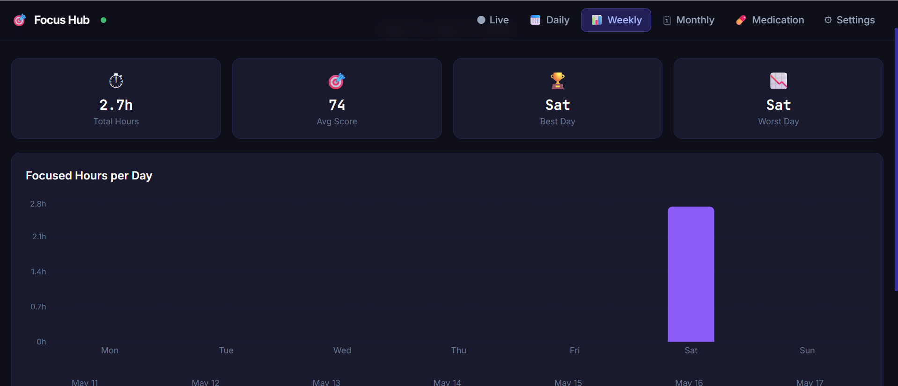

# 🎯 Focus Hub

> A personal ADHD focus environment monitor — built from scratch with Arduino sensors, a Python bridge, and an AI coaching engine.

---

## Why I Built This

I have ADHD. Managing focus isn't just about willpower — the physical environment plays a huge role: temperature, noise, light levels, even humidity can silently drain concentration without you realizing it.

I wanted to **measure** my environment instead of guessing. So I wired up a 4-sensor array to an Arduino, built a Python bridge to stream the data, and connected it to an AI coach (Gemini) that analyzes everything in real time and tells me exactly what to fix.

The result changed something concrete: the AI pointed out my room was consistently too warm and too dim. I moved rooms. My focus improved.

**Built and deployed in 1 day. Still running.**

---

## What It Does

- 📡 **Reads 4 sensors live** — temperature, humidity, noise level, and light intensity
- 🧠 **Calculates a Focus Score (0–100)** based on optimal ranges for each metric
- 🤖 **AI Focus Coach** — Gemini analyzes your environment and tells you exactly what's hurting your focus
- 📅 **Tracks sessions** — logs every study session with start/end times and environment data
- 💊 **Medication log** — track ADHD medication doses and timing
- 📓 **Daily journal** — write notes that Gemini reads when doing its daily analysis
- 📊 **Weekly & monthly views** — see patterns over time

---

## Screenshots

### Live Dashboard

### AI Focus Coach + Live Feed

### Daily View

### Medication & Journal

### Weekly Stats

---

## Architecture

[Arduino Uno]
  ├── DHT11          → Temperature + Humidity
  ├── Sound sensor   → Noise level (dB)
  └── Light sensor   → Lux
        |
        | Serial USB
        ↓
[Python Bridge]
  ├── Reads serial data from Arduino
  ├── Calculates focus score
  ├── Stores sessions to Firebase
  └── Exposes REST API
        |
        | HTTP
        ↓
[Web Frontend]
  ├── Live dashboard (React + Vite)
  ├── Daily / Weekly / Monthly views
  ├── Medication tracker
  └── Gemini AI integration

---

## Hardware

| Component | Purpose | Notes |
|-----------|---------|-------|
| Arduino Uno | Microcontroller | Reads all sensors over serial |
| DHT11 | Temperature + Humidity | Needs voltage divider from 5V Arduino |
| Sound sensor module | Noise level | Analog output |
| Light sensor (LDR / BH1750) | Light intensity (lux) | |
| Breadboard + jumper wires | Wiring | |
| USB cable | Serial connection to PC | Powers Arduino + data |

---

## Stack

- **Hardware:** Arduino Uno, DHT11, sound sensor, light sensor
- **Firmware:** Arduino C++
- **Backend:** Python (serial bridge)
- **Frontend:** React + Vite
- **AI:** Google Gemini 2.5 Flash
- **Built with:** Claude Code

---

## What I Learned

- How to wire mixed-voltage components (5V/3.3V) safely using voltage dividers
- How a simple microcontroller over USB serial can power a surprisingly capable system
- That combining cheap sensors with AI surfaces insights not obvious from raw numbers
- That your environment affects your focus more than you think

---

## About

3rd year Electrical & Computer Engineering student at Ben-Gurion University.
This project is part of a broader effort to use engineering to solve real personal problems.

---

*Built in May 2026 · Personal project*